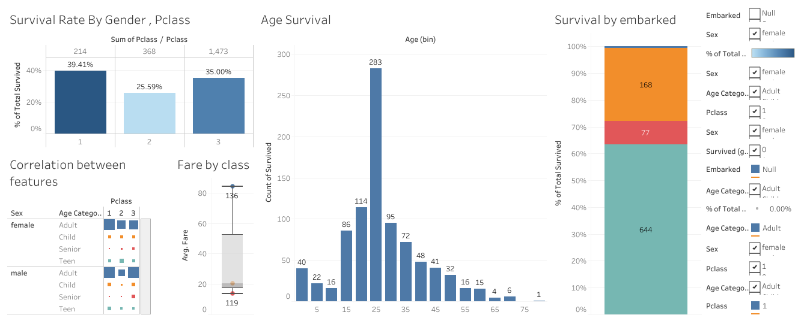

# Titanic Data Analysis Project  

## 📊 Overview  
This project analyzes the Titanic dataset using SQL, Excel, and Tableau. The goal is to identify survival trends based on different factors like passenger class, gender, and fare.  

## 🔍 Key Insights  
- **Higher-class passengers had a higher survival rate**.  
- **Women and children had a better survival chance than men**.  
- **Passengers who paid a higher fare had better survival rates**.  

## 📁 Files Included  
- `Titanic_Cleaned.sql` (SQL queries for data cleaning)  
- `Titanic_Cleaned.xlsx` (Excel analysis)  
- `Titanic_Visualization.twbx` (Tableau dashboard)  
- `Titanic_Dashboard.png` (Dashboard image)  

## 📊 Tableau Dashboard  
  

## 📖 Blog Post  
Read more about this project here: [Medium Blog](link)  

---
